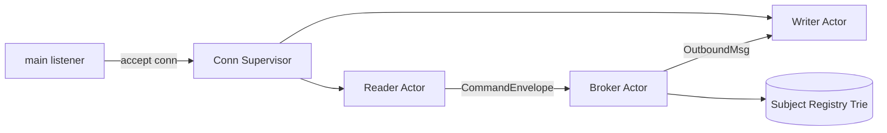
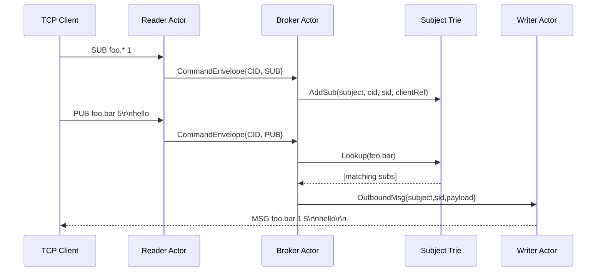

# Pub-Sub Server Design (Actor Model) - Minimal Core NATS Clone

## Status
Draft v0.1 (working design for implementation)

## Summary
This design uses an actor-style architecture:
- `main` accepts TCP connections.
- Each connection gets two goroutines:
  - reader actor: decode wire protocol into commands.
  - writer actor: serialize outbound frames to socket.
- A single broker actor owns routing state (subject trie + subscription index), processes commands sequentially, and performs fanout.

The key idea is ownership:
- Broker is the only goroutine that mutates/reads subscription routing state.
- Connection writer is the only goroutine that writes to a socket.
- No mutex is needed for broker-owned routing state.

## Goals
- Keep concurrency model simple and race-resistant.
- Avoid locks in hot routing path.
- Preserve per-connection outbound order.
- Support wildcard subjects (`*`, `>`) using the existing trie logic.

## Non-Goals (for now)
- Cluster/federation.
- Durable storage.
- Exactly-once delivery.
- Auth/TLS protocol details.

## High-Level Architecture


## Actors and Responsibilities
### 1) Main / Connection Supervisor
- Accepts TCP connections.
- Assigns a unique `CID` per connection.
- Creates per-connection channels and launches:
  - `readerLoop(CID, conn, brokerInbox, control)`
  - `writerLoop(CID, conn, outboundMailbox, control)`
- Handles shutdown coordination for each connection.

### 2) Reader Actor (per connection)
- Owns decoding from wire (`internal/codec`).
- For each decoded command, sends a `CommandEnvelope` to broker.
- Does not mutate routing state directly.
- On decode/connection error: notifies broker of disconnect.

### 3) Writer Actor (per connection)
- Owns all writes to the socket.
- Receives `OutboundMsg` from broker via mailbox channel.
- Encodes server responses (`MSG`, `+OK`, `ERR`, `PONG`, etc.) and flushes.
- If mailbox policy is exceeded (slow client), follows configured policy (recommended: disconnect client).

### 4) Broker Actor (single goroutine)
- Single consumer of `brokerInbox <-chan CommandEnvelope`.
- Owns:
  - subject registry / trie.
  - connection directory (`CID -> clientRef`).
  - optional per-client metadata (subscriptions, stats).
- Executes command semantics:
  - `SUB`: add subscription.
  - `UNSUB`: remove subscription.
  - `PUB`: lookup matching subs and fanout to target writers.
  - `PING`: respond with `PONG`.
  - disconnect event: remove all subs for `CID`, cleanup client state.

## Message Contracts
```go
type CommandEnvelope struct {
    CID   int64
    Cmd   codec.Command
}

type ClientRef struct {
    CID      int64
    Outbound chan<- OutboundMsg
}

type OutboundMsg struct {
    Subject []byte
    SID     int64
    Payload []byte
}
```

Notes:
- The trie should reference a `ClientRef` (or `CID` resolved via broker map), not `net.Conn`.
- Keep socket details isolated to writer actor.

## End-to-End Flow


## State Ownership and Locking
- Broker-owned state is single-threaded: no `sync.Mutex` required.
- If `SubjectRegistry` remains package-level reusable, keep locking optional or document broker-only usage.

## Backpressure and Slow Consumers
Decision required:
- Each writer mailbox should be bounded (recommended).
- On full mailbox:
  - Option A (recommended): disconnect slow client.
  - Option B: drop messages.
  - Option C: block broker (not recommended; harms global throughput).

Decision for v1:
- Use bounded mailbox + disconnect on full queue.

Tradeoff:
- `disconnect`: simplest safe behavior and protects broker throughput, but aggressive for slow clients.
- `drop`: keeps connections alive but introduces silent data loss unless surfaced to clients.
- `block`: easiest code path but lets one slow client stall global progress.

## Error Handling
- Parse error in reader: send protocol error then disconnect.
- Writer error: connection closed; broker receives disconnect event and cleans subscriptions.
- Broker should treat unknown `UNSUB` as safe no-op or protocol error (choose and document).

Decision for v1:
- Unknown `UNSUB` is a no-op.

## Disconnect and Cleanup
On connection close/error:
1. reader or writer emits `Disconnect{CID}` to broker.
2. broker removes all subscriptions for that `CID`.
3. broker removes `CID` from client directory.
4. supervisor closes remaining goroutine/channels safely.

## Current Fit with Existing Code
- `internal/codec` already decodes commands (`PING`, `PONG`, `CONNECT`, `SUB`, `UNSUB`, `PUB`).
- `internal/subjectregistry` already supports wildcard lookup and `(CID,SID)` removal.
- Needed refactor:
  - Replace placeholder `subjectregistry.client` with real broker-facing `ClientRef` concept.
  - Move synchronization responsibility to broker loop (and remove internal lock if broker-owned).

## Risks and Design Issues to Resolve
1. Ordering guarantees: define required ordering across different subjects for same client.
2. Control-plane responses: exact protocol output for `+OK`, `-ERR`, and `PONG`.

Decisions for v1:
- `CONNECT` is optional for now (accepted but not required before `SUB`/`PUB`/`UNSUB`).
- Duplicate `SUB` entries are allowed; client is responsible for avoiding duplicates.
- Payload fanout uses shared immutable `[]byte` across recipients.
- Delivery semantics are at-most-once for v1.
- Use one global broker goroutine for v1.

Payload fanout tradeoff:
- Shared immutable slice avoids per-subscriber copies and is simpler/faster.
- It requires a strict rule: payload bytes are never mutated after `PUB` decode.
- Memory for a payload remains live until all queued outbound references are drained.

## Broker Scaling Note (Deferred)
- Subject-hash sharding is deferred.
- With wildcard subscriptions (`*`, `>`), routing correctness across shards requires either:
  - cross-shard subscription replication, or
  - an additional global index/router layer.
- Both add coordination complexity, so v1 stays with a single broker actor.

## Suggested Implementation Order
1. Introduce broker loop and channel contracts (`CommandEnvelope`, `Disconnect`, `OutboundMsg`).
2. Implement connection supervisor with reader/writer goroutines.
3. Integrate broker with existing `SubjectRegistry`.
4. Define and enforce backpressure policy for writer mailbox.
5. Add integration tests with multiple clients and wildcard subscriptions.

## Clarifying Questions
- None open right now.
