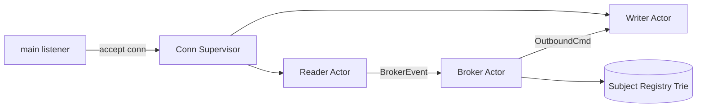
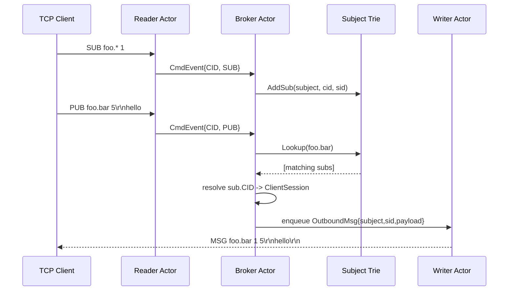

# Pub-Sub Server Design (Actor Model) - Minimal Core NATS Clone

## Status
Draft v0.1 (working design for implementation)

## Summary
This design uses an actor-style architecture:
- `main` accepts TCP connections.
- Each connection gets two goroutines:
  - reader actor: decode wire protocol into commands.
  - writer actor: serialize outbound frames to socket.
- A single broker actor owns routing state (subject trie + subscription index), processes commands sequentially, and performs fanout.

The key idea is ownership:
- Broker is the only goroutine that mutates/reads subscription routing state.
- Connection writer is the only goroutine that writes to a socket.
- No mutex is needed for broker-owned routing state.

## Goals
- Keep concurrency model simple and race-resistant.
- Avoid locks in hot routing path.
- Preserve per-connection outbound order.
- Support wildcard subjects (`*`, `>`) using the existing trie logic.

## Non-Goals (for now)
- Cluster/federation.
- Durable storage.
- Exactly-once delivery.
- Auth/TLS protocol details.

## High-Level Architecture


## Actors and Responsibilities
### 1) Main / Connection Supervisor
- Accepts TCP connections.
- Assigns a unique `CID` per connection.
- Creates per-connection channels and launches:
  - `readerLoop(CID, conn, brokerInbox, control)`
  - `writerLoop(CID, conn, outboundMailbox, control)`
- Emits `SessionUpEvent` once outbound mailbox wiring is ready.
- Handles shutdown coordination for each connection.

### 2) Reader Actor (per connection)
- Owns decoding from wire (`internal/codec`).
- For each decoded command, sends a `CmdEvent` to broker.
- Does not mutate routing state directly.
- On decode/connection error: emits `SessionDownEvent`.

### 3) Writer Actor (per connection)
- Owns all writes to the socket.
- Receives `OutboundCmd` from broker via mailbox channel.
- Encodes server responses (`MSG`, `+OK`, `ERR`, `PONG`, etc.) and flushes.
- If mailbox policy is exceeded (slow client), follows configured policy (recommended: disconnect client).

### 4) Broker Actor (single goroutine)
- Single consumer of `brokerInbox <-chan BrokerEvent`.
- Owns:
  - subject registry / trie.
  - connection directory (`map[CID]ClientSession`).
  - optional per-client metadata (subscriptions, stats).
- Executes command semantics:
  - `SUB`: add subscription.
  - `UNSUB`: remove subscription.
  - `PUB`: lookup matching subs and fanout to target writers.
  - `PING`: respond with `PONG`.
  - heartbeat: periodically send server `PING`, require `PONG` to keep session alive.
  - session down event: remove all subs for `CID`, cleanup client state.

## Message Contracts
```go
type BrokerEvent interface{ isBrokerEvent() }

// Wire command from reader actor.
type CmdEvent struct {
    CID int64
    Cmd codec.Command
}
func (CmdEvent) isBrokerEvent() {}

// Session lifecycle from connection supervisor.
type SessionUpEvent struct {
    CID      int64
    Outbound chan<- OutboundCmd
}
func (SessionUpEvent) isBrokerEvent() {}

type SessionDownEvent struct {
    CID int64
    Why error // optional
}
func (SessionDownEvent) isBrokerEvent() {}

// Stored in subject registry / trie.
// Routing metadata only: no socket or channel pointers.
type Sub struct {
    CID int64
    SID int64
}
```

Notes:
- The trie stores `Sub{CID,SID}` only, never `net.Conn` or outbound channels.
- Broker resolves `CID -> ClientSession` and enqueues onto that session's writer mailbox.
- Keep socket details isolated to connection supervisor/writer actor.
- Writer does not run protocol business logic; it only serializes `OutboundCmd` values in-order.

Recommended broker-owned session record:
```go
type ClientSession struct {
    Outbound     chan<- OutboundCmd
    AwaitingPong bool
    PingSentAt   time.Time
}
```

Rationale:
- Keep outbound mailbox and heartbeat state in the same broker-owned map.
- Session lifetime, disconnect policy, and heartbeat transitions all stay in one place.
- Avoid keeping a second heartbeat index/list that must be updated in lockstep with connect/disconnect.

## End-to-End Flow


## State Ownership and Locking
- Broker-owned state is single-threaded: no `sync.Mutex` required.
- If `SubjectRegistry` remains package-level reusable, keep locking optional or document broker-only usage.
- Connection/session state is broker-owned by identity (`CID`).

## Backpressure and Slow Consumers
Decision required:
- Each writer mailbox should be bounded (recommended).
- On full mailbox:
  - Option A (recommended): disconnect slow client.
  - Option B: drop messages.
  - Option C: block broker (not recommended; harms global throughput).

Decision for v1:
- Use bounded mailbox + disconnect on full queue.

Tradeoff:
- `disconnect`: simplest safe behavior and protects broker throughput, but aggressive for slow clients.
- `drop`: keeps connections alive but introduces silent data loss unless surfaced to clients.
- `block`: easiest code path but lets one slow client stall global progress.

## Heartbeat
Decision for v1:
- Broker owns heartbeat state and heartbeat policy.
- Liveness is proven only by receiving `PONG`.
- Server-originated heartbeat uses protocol `PING`.
- If a session does not answer a broker `PING` with `PONG` before timeout, broker disconnects it.

Why this shape:
- Broker already owns the session directory and disconnect path.
- Heartbeat is protocol behavior, not socket plumbing, so it belongs with command handling.
- Using only `PONG` as the liveness signal keeps the state machine simple and explicit.

Recommended flow:
1. Broker receives a periodic internal tick event.
2. For each connected session:
   - if `AwaitingPong` is `false`, enqueue `PING`, then set `AwaitingPong=true` and record `PingSentAt`
   - if `AwaitingPong` is `true` and timeout has elapsed since `PingSentAt`, disconnect the session
3. When broker receives inbound `PONG` for a `CID`, set `AwaitingPong=false`

Deliberate simplification for v1:
- Do not treat arbitrary client traffic as proof of life.
- Only an explicit `PONG` clears the outstanding heartbeat.
- This may disconnect a client that is otherwise active but does not answer `PING`; that is acceptable for the first version because it keeps heartbeat semantics unambiguous.

Data structure decision:
- Reuse the broker's existing session directory and store heartbeat fields alongside the outbound mailbox.
- Do not create a separate heartbeat list/map unless profiling later shows scan cost is a real problem.
- With one global broker goroutine in v1, a linear scan of connected sessions on each heartbeat tick is operationally simple and keeps connect/disconnect bookkeeping centralized.

## Error Handling
- Parse error in reader: send protocol error then disconnect.
- Writer error: connection closed; broker receives `SessionDownEvent` and cleans subscriptions.
- Broker should treat unknown `UNSUB` as safe no-op or protocol error (choose and document).

Decision for v1:
- Unknown `UNSUB` is a no-op.

## Disconnect and Cleanup
On connection close/error:
1. reader or supervisor emits `SessionDownEvent{CID}` to broker.
2. broker removes all `SIDs` for that `CID` from subject registry.
3. broker removes `CID` from client directory.
4. supervisor closes remaining goroutine/channels safely.

## Current Fit with Existing Code
- `internal/codec` already decodes commands (`PING`, `PONG`, `CONNECT`, `SUB`, `UNSUB`, `PUB`).
- `internal/subjectregistry` already supports wildcard lookup and `(CID,SID)` removal.
  - Move synchronization responsibility to broker loop (and remove internal lock if broker-owned).

## CID Assignment Tradeoff
- Decision for v1: `CID` is a server-assigned monotonic counter and is never reused.
- With non-reused monotonic `CID`s, an `Epoch` field is not required for correctness.
- If future designs recycle `CID`s, add a per-session generation (`Epoch`) to guard against stale async events (for example, delayed disconnect events affecting a new session that reused a `CID`).

## Risks and Design Issues to Resolve
1. Ordering guarantees: define required ordering across different subjects for same client.
2. Control-plane responses: exact protocol output for `+OK`, `-ERR`, and `PONG`.

Decisions for v1:
- `CONNECT` is optional for now (accepted but not required before `SUB`/`PUB`/`UNSUB`).
- Duplicate `SUB` entries are allowed; client is responsible for avoiding duplicates.
- Payload fanout uses shared immutable `[]byte` across recipients.
- Delivery semantics are at-most-once for v1.
- Use one global broker goroutine for v1.

Payload fanout tradeoff:
- Shared immutable slice avoids per-subscriber copies and is simpler/faster.
- It requires a strict rule: payload bytes are never mutated after `PUB` decode.
- Memory for a payload remains live until all queued outbound references are drained.

## Broker Scaling Note (Deferred)
- Subject-hash sharding is deferred.
- With wildcard subscriptions (`*`, `>`), routing correctness across shards requires either:
  - cross-shard subscription replication, or
  - an additional global index/router layer.
- Both add coordination complexity, so v1 stays with a single broker actor.

## Suggested Implementation Order
1. Implement broker as a minimal loop with 
   1. one inbox channel, 
   2. broker-owned client directory (`CID -> ClientSession`), 
   3. and no `Epoch` in v1 (monotonic non-reused `CID`).
2. Define minimal broker event contracts and wire them end-to-end (`CmdEvent`, `SessionUpEvent`, `SessionDownEvent`, `OutboundCmd` + concrete variants).
3. Implement connection supervisor with reader/writer goroutines and connect them to broker inbox/outbound mailboxes.
4. Integrate broker with existing `SubjectRegistry` for `SUB`/`UNSUB`/`PUB` and disconnect cleanup.
5. Define and enforce backpressure policy for bounded writer mailbox (disconnect on full queue for v1).
6. Add integration tests with multiple clients, wildcard subscriptions, and disconnect cleanup.

## Clarifying Questions
- None open right now.
